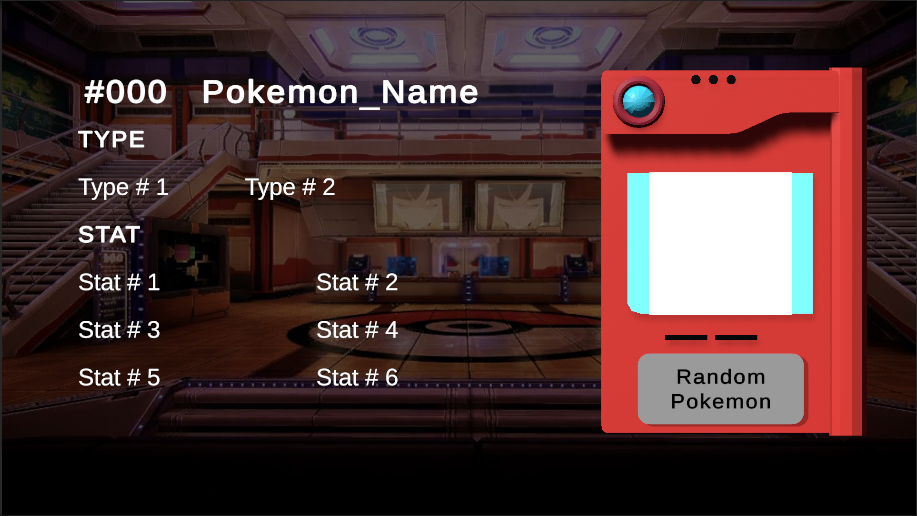
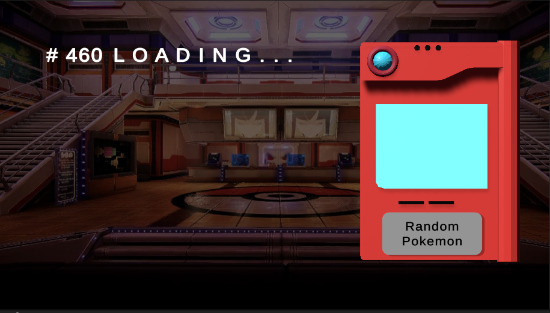
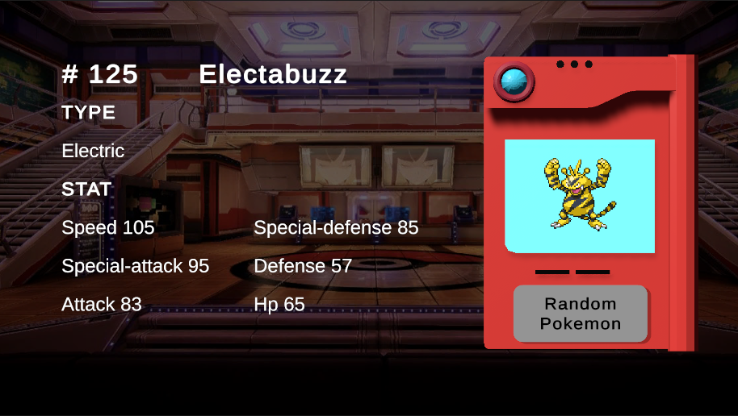

# Pokedex-PokeAPI-Unity

# Pokedex App - Unity Powered 📱🌐

## Description 🚀🔍

Welcome to the captivating Pokedex App, powered by Unity! Embark on an exhilarating adventure through the enchanting world of Pokemon, where every tap reveals a random Pokemon, thanks to the mystical PokeAPI integration. Experience the thrill of discovery as vibrant Pokemon sprites come to life, accompanied by their names, types, and stats, making you a true Pokemon Master. The Pokedex App ensures seamless playability on both browsers and mobile phones, allowing you to enjoy the magical journey anytime, anywhere! 🌟🐾

## Features 🎮🎨

🔮 Get surprised with a random Pokemon on each tap using the PokeAPI!  
🎨 Explore captivating Pokemon sprites, names, types, and stats.  
🌐 Playable on browsers and mobile phones - the adventure is at your fingertips!  
🤝 Connect with fellow trainers and share your epic Pokemon discoveries.  
👑 Grow as a legendary Pokemon Trainer with a deeper knowledge of each Pokemon.  

## Play Now 🎉🌐

Ready to catch 'em all? Begin your extraordinary journey in the Pokemon universe by playing our Pokedex App! Simply click the link below: 

🔥 [Play Pokedex App Now](https://colossalmonk.itch.io/pokedex) 🔥

## Screenshots 📸🌈

## Installation 🛠️

No installation is required! Just click the play link and start your Pokemon adventure instantly.

## Feedback 🗣️💬

I'd love to hear your thoughts on the Pokedex App! Share your feedback, suggestions, or any Pokemon discoveries on our community platform. Let's celebrate the joy of Pokemon together!

## License 📜✅

This project is licensed under the [MIT License](LICENSE).
